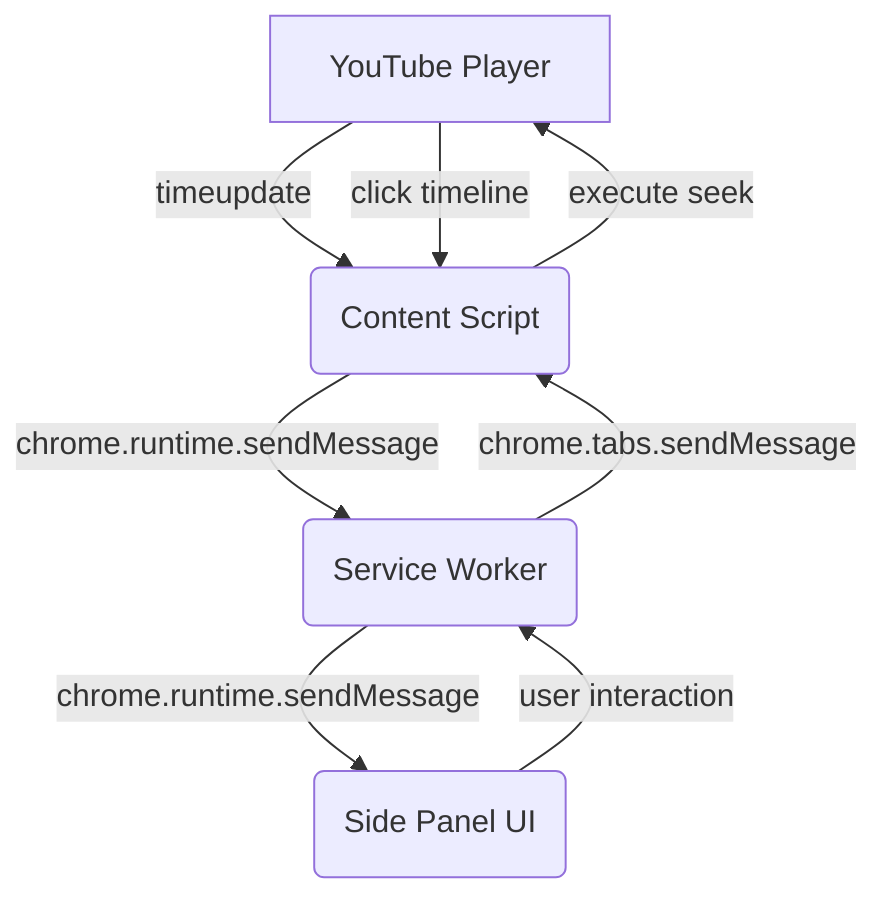

# Architecture Design: Perspective Prism Chrome Extension UX v3

## 1. Overview
The Perspective Prism Chrome Extension is migrating its primary user interface from an injected, in-DOM overlay to the native Chrome Side Panel API. This migration aims to provide a persistent, native-feeling experience that survives YouTube SPA navigations and full page reloads. In conjunction with this structural shift, the extension will integrate deeply with the YouTube video player timeline, visualizing claims directly on the progress bar and synchronizing the side panel UI with video playback.

## 2. Core Components

### 2.1 Chrome Side Panel (Manifest V3)
- **Role:** Serves as the primary viewing surface for analysis results (truth profiles, bias indicators, per-perspective analysis).
- **Behavior:** Persists across navigations within the tab. It is bound to the tab rather than the specific document, meaning it can maintain state smoothly as the user clicks through different YouTube videos.
- **Toggle Mechanism:** Users can toggle the side panel via the extension icon in the browser toolbar or an injected button within the YouTube interface (near the subscribe/share buttons).

### 2.2 Timeline Marker System (Injected via Content Script)
- **Role:** Visualizes the chronological locations of analyzed claims directly on the YouTube video progress bar (`.ytp-progress-list`).
- **Clustering:** Given that YouTube videos can be dense with claims, individual claim markers that fall within a close temporal threshold (e.g., within 5 seconds of each other) will be grouped into "Cluster Markers."
- **Visual Language:** Markers will be color-coded based on the aggregate truth profile of the claims they represent (e.g., Red = Suspicious/Deceptive, Yellow = Mixed, Green = Likely True).

### 2.3 Playback Synchronization Engine
- **Role:** A bidirectional sync bridge between the YouTube player (managed by `content.js`) and the Side Panel UI.
- **Auto-Scrolling:** As the video's `currentTime` advances, `content.js` broadcasts time-update events. To ensure identity matching, all synchronization messages MUST include the active `videoId` and a navigation generation counter. The Side Panel listens to these events, rejects any stale messages from a previous video context, and automatically scrolls to and highlights the claim currently being discussed in the video.
- **Click-to-Seek / Click-to-Highlight:** Clicking a timeline cluster marker seeks the video to that timestamp *and* triggers the Side Panel to scroll to that specific cluster, visually denoting all claims within it.

## 3. Architecture & Data Flow

### 3.1 State Management & Browser-First Caching
Because the side panel and the content script operate in different contexts, state (such as the currently active video ID, the analysis results, and the playback time) must be synchronized via the Service Worker (`background.js`).
- **Browser-First Caching Constraint:** To minimize operational costs and ensure user privacy, the backend architecture MUST remain stateless regarding caching. All caching of analysis results across SPA navigations or tab closures MUST rely exclusively on `chrome.storage.local` within the user's browser. The backend should not host a database for storing video analysis histories.
- **Cache Key Design & Isolation:** Cache keys must use the `cache_` prefix combined with the `videoId` (e.g., `cache_{videoId}`). This strict isolation ensures lookups can never inadvertently return another video's analysis. The `schemaVersion` must be stored as embedded metadata within the cached object itself, rather than in the key, to ensure readers, writers, and eviction logic can uniformly manage the cache entries.
- **Freshness & Eviction Policy:** Cached results are evaluated for staleness by comparing their embedded `schemaVersion` against the extension's current analysis schema version; any mismatch renders the cache entry stale, requiring a fresh network fetch. To prevent exceeding `chrome.storage.local` quota constraints, eviction must follow an LRU (Least Recently Used) policy. If a quota-write or read failure occurs, the extension must gracefully fall back to an in-memory session cache and proceed with the analysis request without breaking the user experience.
- When the side panel opens or the video changes, the side panel queries the Service Worker, which first checks `chrome.storage.local` before ever initiating a new request to the backend. Any storage access failures must be caught and handled without breaking the analysis pipeline.

## 4. Constraints & Risks
1. **YouTube DOM Volatility:** YouTube frequently A/B tests its player UI. The selector for the progress bar (`.ytp-progress-list`) must be resilient or easily updatable.
2. **SPA Navigation (yt-navigate-finish):** YouTube does not reload the page when navigating between videos. The content script must gracefully clean up old timeline markers and re-initialize without memory leaks.
3. **Performance:** The `timeupdate` event fires frequently (multiple times per second). The auto-scroll logic in the side panel must enforce a maximum of four updates per second using a fixed 250ms throttle. Do not rely on an unbounded `requestAnimationFrame` loop.
4. **Side Panel API Limitations:** The side panel cannot be programmatically opened *by a content script directly* without a user gesture triggering an action, or without configuring `chrome.sidePanel.setPanelBehavior`. We must configure the service worker to open the panel when the injected button is clicked via `chrome.sidePanel.open()`.
