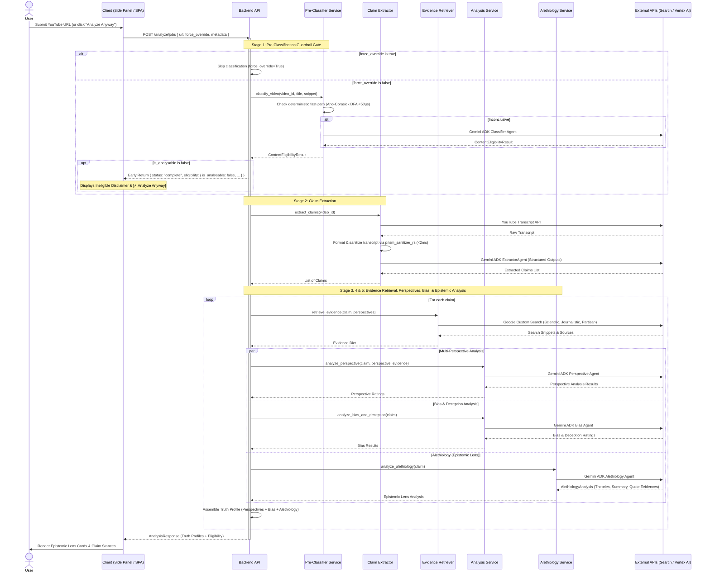

# System Architecture

## High-Level Architecture

```mermaid
graph TD
    User[User] -->|Interacts with| Client[Frontend (React 19 / Vite)]
    User -->|Views YouTube| ExtUI["Chrome Extension Side Panel (sidepanel.html)"]
    
    subgraph Chrome Extension (MV3)
        ExtUI -->|Message Channel| SW[Service Worker (background.js)]
        SW <-->|Content Hash Cache| Storage[chrome.storage.local]
    end

    Client -->|HTTP/JSON| API[Backend API (FastAPI)]
    SW -->|HTTPS / Job Polling| API
    
    subgraph Backend Pipeline
        API -->|Stage 1: Pre-Classification| PC[Content Classifier Service]
        API -->|Stage 2: Claim Extraction| CE[Claim Extractor]
        API -->|Stage 3: Evidence Retrieval| ER[Evidence Retriever]
        API -->|Stage 4: Perspective & Bias| AS[Analysis Service]
        API -->|Stage 5: Epistemic Lens| AL[Alethiology Service]
    end
    
    subgraph External Services & Foundation Models
        PC -->|Aho-Corasick DFA & Prompt| Vertex[GCP Vertex AI Gemini 3.8 Flash]
        CE -->|Fetches| YT[YouTube Transcript API]
        CE -->|Structured Extraction| Vertex
        ER -->|Multi-Perspective Queries| GCS[Google Custom Search API]
        AS -->|Stance & Deception Analysis| Vertex
        AL -->|Epistemic Truth Theories| Vertex
    end
    
    subgraph Rust Native Core Engine (prism_sanitizer_rs)
        RS["PyO3 Compiled Extension\n(Unified Sanitizer, Aho-Corasick DFA, Transcript Processor, Delimiter Guard)"]
    end

    API -.->|Sanitize Input & Delimiters| RS
    PC -.->|Aho-Corasick Fast-Path (<50µs)| RS
    CE -.->|Vectorized Chunking (<2ms)| RS
    AL -.->|Prompt Nonce Delimiter Guard| RS
    
    style User fill:#f9f,stroke:#333,stroke-width:2px
    style Client fill:#bbf,stroke:#333,stroke-width:2px
    style ExtUI fill:#bbf,stroke:#333,stroke-width:2px
    style SW fill:#dfd,stroke:#333,stroke-width:1px
    style Storage fill:#ffd,stroke:#333,stroke-width:1px
    style API fill:#bfb,stroke:#333,stroke-width:2px
    style PC fill:#ffe,stroke:#333,stroke-width:1px
    style CE fill:#dfd,stroke:#333,stroke-width:1px
    style ER fill:#dfd,stroke:#333,stroke-width:1px
    style AS fill:#dfd,stroke:#333,stroke-width:1px
    style AL fill:#eef,stroke:#333,stroke-width:1px
    style RS fill:#ffd,stroke:#e65100,stroke-width:2px
```

### Security & Native Performance Boundary
Perspective Prism enforces strict CPU-bound workload isolation under [ADR 001](docs/adr/001-non-greedy-rust-sanitizer-via-pyo3.md) and [ADR 006](docs/adr/006-rust-native-core-engine.md):
- **Single-Crossing FFI Boundary**: Reduces Python-to-Rust crossings to 1 call per string (`sanitize_input`), eliminating chatty serialization overhead.
- **DFA Multi-Pattern Fast-Path**: Aho-Corasick automaton searches 65+ political keywords simultaneously in linear time $O(N)$ with zero backtracking in **<50µs** (8.7x speedup over Python regex).
- **Vectorized Chunking**: Pre-allocates buffer capacity for 100k-character transcripts, eliminating quadratic memory allocations and executing in **<2ms** (15x speedup).
- **Prompt Nonce Delimiter Isolation Guard**: Dynamically wraps prompts in per-request cryptographic nonces (`===USER DATA <nonce> START===`) and scans for unescaped closing delimiters via `contains_delimiter_forgery()`, neutralizing adversarial prompt injections while preserving Gemini context caching.
- **Specification Index**: The complete technical blueprint is documented under [`docs/rust-core-engine-spec/`](docs/rust-core-engine-spec/).

### Zero-Throttling Foundation Model Architecture (ADR 007)
The pipeline is optimized for **Gemini 3.8 Flash** under [ADR 007](docs/adr/007-gemini-38-flash-capability-optimization.md), prioritizing native reasoning depth and output completeness over cost or throttling:
- **Dynamic `thinking_level` Partitioning**:
  - **Stage 1 (Pre-Classification Gate)**: Micro-task screening runs with `thinking_level="LOW"` and `max_output_tokens=2048` to preserve sub-second short-circuit latency.
  - **Stages 2, 4, & 5 (Claim Extraction, Perspective Analysis, Alethiology)**: Deep analytical agents enforce `thinking_level="HIGH"`, unlocking native internal reasoning for decomposing nuanced claims, detecting deception, and synthesizing epistemic truth theories.
- **Immutable Analytical Floors**: Factory `build_agent_generation_config` strictly guarantees `max_output_tokens >= 65536` (64K ceiling) and `http_timeout >= 120.0` (120s runway) for all analytical tasks, protecting against accidental throttling from blanket environment variables.
- **Thought Signature & Token Preservation**: Telemetry sanitizers explicitly exclude thinking tokens (`EXCLUDED_TELEMETRY_KEYS`) to preserve multi-turn agent memory continuity and reasoning traces.

---

## Analysis Flow & Pipeline Stages



---

## Data Schemas & API Contracts

### 1. Job Submission (`POST /analyze/jobs`)
```json
{
  "url": "https://www.youtube.com/watch?v=abcdefghijk",
  "force_override": false,
  "metadata": {
    "title": "Video Title",
    "channel_name": "Channel Name",
    "category_id": "25",
    "category_name": "News & Politics",
    "tags": ["news", "politics"],
    "description_snippet": "First 250 characters of description"
  }
}
```

### 2. Content Eligibility Schema (`ContentEligibilityResult`)
```json
{
  "is_analysable": false,
  "confidence_score": 0.95,
  "detected_category": "Music",
  "disclaimer_title": "Content Not Analysable",
  "disclaimer_message": "This video appears to be musical or entertainment content lacking factual empirical claims.",
  "key_topics_found": [
    "music video",
    "lyrics"
  ]
}
```

### 3. Alethiology Schema (`AlethiologyAnalysis`)
```json
{
  "primary_theory": "Correspondence (Empirical)",
  "secondary_theory": "Coherence (Systemic Narrative)",
  "epistemic_summary": "The claim relies primarily on empirical observation and sensor measurement, supported by structural consistency with thermodynamic models.",
  "quote_evidences": [
    "Measurements recorded by the orbital probe confirmed a 1.2% variance."
  ]
}
```

### 4. Client Integration Models
* **Chrome Extension Side Panel**:
  * `#state-ineligible`: Displays category chip, confidence gauge, explanatory disclaimer text, and accessible `[⚡ Analyze Anyway]` button.
  * `.pp-epistemic-lens-card`: Displays primary/secondary theory badges, an epistemic synthesis paragraph, and an expandable evidence drawer (`.pp-quote-drawer`).
* **React Frontend SPA**:
  * `EligibilityDisclaimer.tsx`: Renders the guardrail warning with force-override triggering.
  * `EpistemicLensCard.tsx`: Renders the philosophical truth theory breakdown.
