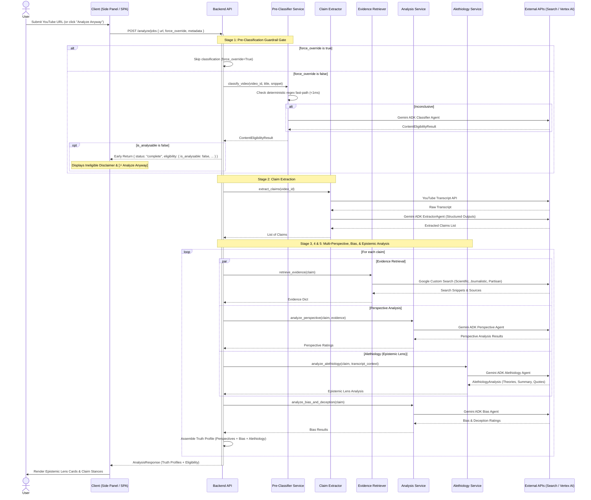

# System Architecture

## High-Level Architecture

```mermaid
graph TD
    User[User] -->|Interacts with| Client[Frontend (React 19 / Vite)]
    User -->|Views YouTube| ExtUI["Chrome Extension Side Panel (sidepanel.html)"]
    
    subgraph Chrome Extension (MV3)
        ExtUI -->|Message Channel| SW[Service Worker (background.js)]
        SW <-->|Content Hash Cache| Storage[chrome.storage.local]
    end

    Client -->|HTTP/JSON| API[Backend API (FastAPI)]
    SW -->|HTTPS / Job Polling| API
    
    subgraph Backend Pipeline
        API -->|Stage 1: Pre-Classification| PC[Content Classifier Service]
        API -->|Stage 2: Claim Extraction| CE[Claim Extractor]
        API -->|Stage 3: Evidence Retrieval| ER[Evidence Retriever]
        API -->|Stage 4: Perspective & Bias| AS[Analysis Service]
        API -->|Stage 5: Epistemic Lens| AL[Alethiology Service]
    end
    
    subgraph External Services & Foundation Models
        PC -->|Fast Regex & Prompt| Vertex[GCP Vertex AI Gemini 3.x]
        CE -->|Fetches| YT[YouTube Transcript API]
        CE -->|Structured Extraction| Vertex
        ER -->|Multi-Perspective Queries| GCS[Google Custom Search API]
        AS -->|Stance & Deception Analysis| Vertex
        AL -->|Epistemic Truth Theories| Vertex
    end
    
    style User fill:#f9f,stroke:#333,stroke-width:2px
    style Client fill:#bbf,stroke:#333,stroke-width:2px
    style ExtUI fill:#bbf,stroke:#333,stroke-width:2px
    style SW fill:#dfd,stroke:#333,stroke-width:1px
    style Storage fill:#ffd,stroke:#333,stroke-width:1px
    style API fill:#bfb,stroke:#333,stroke-width:2px
    style PC fill:#ffe,stroke:#333,stroke-width:1px
    style CE fill:#dfd,stroke:#333,stroke-width:1px
    style ER fill:#dfd,stroke:#333,stroke-width:1px
    style AS fill:#dfd,stroke:#333,stroke-width:1px
    style AL fill:#eef,stroke:#333,stroke-width:1px
```

---

## Analysis Flow & Pipeline Stages



---

## Data Schemas & API Contracts

### 1. Job Submission (`POST /analyze/jobs`)
```json
{
  "url": "https://www.youtube.com/watch?v=abcdefghijk",
  "force_override": false,
  "metadata": {
    "title": "Video Title",
    "description": "Video Description"
  }
}
```

### 2. Content Eligibility Schema (`ContentEligibilityResult`)
```json
{
  "is_analysable": false,
  "confidence_score": 0.95,
  "detected_category": "Music",
  "disclaimer_title": "Content Not Analysable",
  "disclaimer_message": "This video appears to be musical or entertainment content lacking factual empirical claims.",
  "justification": "Identified official music video markers and lyrical structures."
}
```

### 3. Alethiology Schema (`AlethiologyAnalysis`)
```json
{
  "primary_theory": "correspondence",
  "secondary_theory": "coherence",
  "epistemic_summary": "The claim relies primarily on empirical observation and sensor measurement, supported by structural consistency with thermodynamic models.",
  "quotes": [
    "Measurements recorded by the orbital probe confirmed a 1.2% variance."
  ],
  "confidence_score": 0.88
}
```

### 4. Client Integration Models
* **Chrome Extension Side Panel**:
  * `#state-ineligible`: Displays category chip, confidence gauge, explanatory disclaimer text, and accessible `[⚡ Analyze Anyway]` button.
  * `.pp-epistemic-lens-card`: Displays primary/secondary theory badges, an epistemic synthesis paragraph, and an expandable evidence drawer (`.pp-quote-drawer`).
* **React Frontend SPA**:
  * `EligibilityDisclaimer.tsx`: Renders the guardrail warning with force-override triggering.
  * `EpistemicLensCard.tsx`: Renders the philosophical truth theory breakdown.
