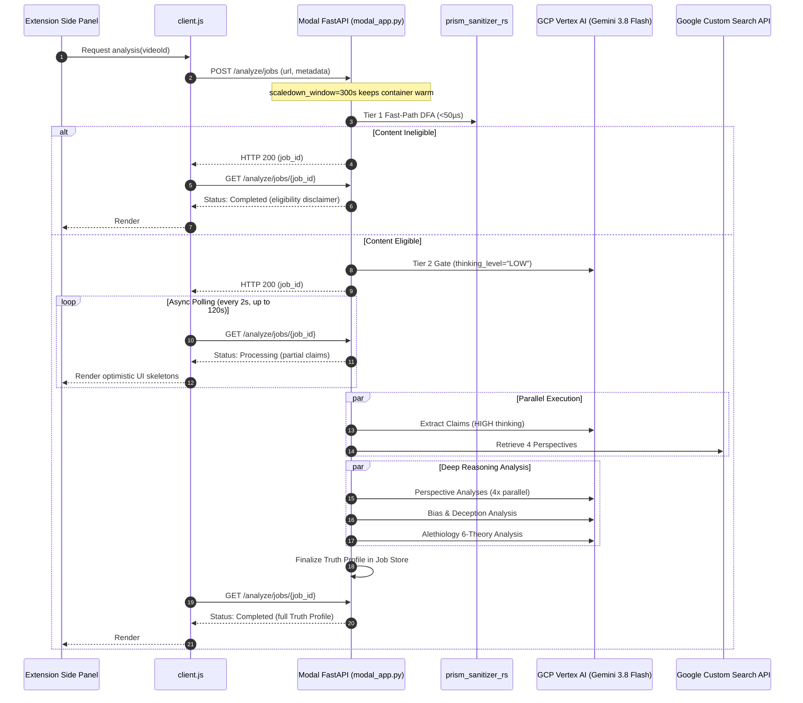

# Modal Labs & GCP Cross-Cloud Deployment Design Specification

## 1. Overview

Perspective Prism operates on a **Cross-Cloud Hybrid Architecture** designed for high-reasoning accuracy, cost efficiency, and zero server maintenance:
* **Modal Labs Tier (Serverless Compute)**: Hosts the containerized FastAPI backend, executes the compiled Rust PyO3 native core engine (`prism_sanitizer_rs`), manages asynchronous job polling state, and scales to zero when idle to conserve Modal's $30/month free-tier compute credits.
* **Google Cloud Platform Tier (Foundation Models & Search)**: Hosts Vertex AI for high-throughput Gemini 3.8 Flash model execution (under [ADR 003](file:///Users/pretermodernist/Developer/Personal/PerspectivePrism/docs/adr/003-mandatory-vertex-ai-paid-tier-and-async-io-standard.md) and [ADR 007](file:///Users/pretermodernist/Developer/Personal/PerspectivePrism/docs/adr/007-gemini-38-flash-capability-optimization.md)), along with Google Custom Search JSON API for multi-perspective evidence retrieval.
* **Client Tier (Chrome Extension)**: Manifest V3 Native Side Panel (`sidepanel.html`, `sidepanel.js`) interacting with the backend via polling, with graceful degradation to a self-hosting CTA upon credit exhaustion.

---

## 2. Architecture Constraints & Modal Integration

### 2.1 Cross-Cloud Topology & Sequence Flow



### 2.2 Compute & Scaling Configuration
* **Container Spec**: 1 vCPU core, 2 GiB Memory (`modal.App` function configuration).
* **Scaling to Zero**: Modal scales containers to 0 when idle. To accommodate asynchronous background tasks (`BackgroundTasks.add_task(process_analysis)`), the ASGI function sets `scaledown_window=300` (5 minutes keep-warm). This guarantees the container does not terminate between `POST /analyze/jobs` and subsequent `GET /analyze/jobs/{job_id}` polling cycles.
* **Concurrency**: `allow_concurrent_inputs=10` routes up to 10 simultaneous HTTP requests into the warm container, matching `Settings.tier_max_concurrency=10`.

### 2.3 Cross-Cloud Secret Management (Option A)
GCP credentials are securely provisioned without baking secrets into the image:
1. **Modal Secret**: A single Modal Secret named `perspective-prism-gcp-secrets` contains:
   * `GCP_SERVICE_ACCOUNT_JSON`: The raw JSON key string of a GCP Service Account possessing `roles/aiplatform.user`.
   * `GCP_PROJECT` / `GOOGLE_CLOUD_PROJECT`: The GCP project ID.
   * `GCP_LOCATION`: `"global"` (or `"us-central1"`).
   * `GEMINI_TIER`: `"paid"`.
   * `GOOGLE_API_KEY`: Google Custom Search API key.
   * `GOOGLE_CSE_ID`: Custom Search Engine ID.
   * `BACKEND_CORS_ORIGINS`: Comma-separated allowed origins.
2. **Container Startup Hook**: In `backend/modal_app.py`, a startup initialization hook reads `os.environ["GCP_SERVICE_ACCOUNT_JSON"]`, writes it to `/tmp/gcp_sa.json`, and sets `os.environ["GOOGLE_APPLICATION_CREDENTIALS"] = "/tmp/gcp_sa.json"`.
3. **No AI Studio Keys**: Legacy `GEMINI_API_KEY` is completely absent, ensuring 100% compliance with [ADR 003](file:///Users/pretermodernist/Developer/Personal/PerspectivePrism/docs/adr/003-mandatory-vertex-ai-paid-tier-and-async-io-standard.md).

---

## 3. Rust Native Core Engine Compilation (ADR 001 & ADR 006)

The container image must build the PyO3 Rust extension (`prism_sanitizer_rs`) with its required system and crate dependencies:

### 3.1 Dependencies
* **System Packages**: `curl`, `build-essential`, `pkg-config`, `gcc`.
* **Rust Toolchain**: `rustup` installing stable `rustc` and `cargo`.
* **Crates**: `pyo3 = "0.29.0"`, `aho-corasick = "1.1.3"`, `unicode-normalization = "0.1.24"`, `regex`, `once_cell`.
* **Python Build Tool**: `maturin>=1.15,<2.0`.

### 3.2 Modal Image Layering Strategy
```python
image = (
    modal.Image.debian_slim(python_version="3.11")
    .apt_install("curl", "build-essential", "pkg-config", "gcc")
    .run_commands(
        "curl --proto '=https' --tlsv1.2 -sSf https://sh.rustup.rs | sh -s -- -y",
        "echo 'source $HOME/.cargo/env' >> /root/.bashrc",
    )
    .env({"PATH": "/root/.cargo/bin:$PATH"})
    .pip_install("maturin>=1.15,<2.0")
    .copy_local_dir("backend/prism_sanitizer_rs", "/root/prism_sanitizer_rs")
    .run_commands("cd /root/prism_sanitizer_rs && maturin develop --release")
    .copy_local_file("backend/requirements.txt", "/root/requirements.txt")
    .pip_install_from_requirements("/root/requirements.txt")
    .copy_local_dir("backend/app", "/root/app")
)
```
This layering ensures:
1. Rust toolchain and dependencies are cached across container builds.
2. The local `prism_sanitizer_rs` source is compiled into the Python environment before installing general requirements.
3. Code changes in `app/` do not invalidate the slow Rust compilation layer.

---

## 4. Cost & Usage Estimates

Modal Labs provides $30.00/month in free compute credits, while GCP provides billing credits for Vertex AI.

### 4.1 Compute Costs (Modal Labs)
* **1 vCPU**: ~$0.0000131 / second
* **2 GiB RAM**: ~$0.00000444 / second
* **Combined Rate**: ~$0.00001754 / second

### 4.2 Workload Modeling with Optimization Pillars
* **Non-Factual Content (ADR 005 / ADR 006 Fast-Path)**:
  ~40% of typical YouTube submissions (music, gaming, vlogs) are identified in **<50µs** by the compiled Aho-Corasick DFA without LLM extraction. Total Modal active time is **<1.0 second**.
* **Factual Content (ADR 007 High-Thinking Pipeline)**:
  ~60% of submissions undergo full multi-perspective extraction, 4 search calls, 4 perspective analyses, bias evaluation, and alethiology analysis under Gemini 3.8 Flash high thinking. Total compute time is **~45 to 75 seconds**.
* **Weighted Average Execution Time**:
  $(0.40 \times 1.0\text{s}) + (0.60 \times 60\text{s}) \approx 36.4\text{ seconds}$ of active compute.
* **Cost per Request**:
  $36.4\text{s} \times \$0.00001754/\text{s} = \mathbf{\$0.000638\text{ per analysis}}$.
* **Monthly Free-Tier Capacity**:
  $\frac{\$30.00}{\$0.000638} \approx \mathbf{47,000\text{ analyses / month}}$ (or ~1,500 daily analyses).
* **GCP Vertex AI Quota**:
  Runs under the enterprise paid tier (300+ RPM quota) funded via GCP credits, with zero AI Studio rate-limit bottlenecks.

---

## 5. Graceful Exhaustion Mechanism (Manifest V3 Side Panel)

Because Perspective Prism is a portfolio project relying on free-tier credits, the system handles credit exhaustion gracefully without crashing the UI.

### 5.1 Error Code Interception
When Modal credits are depleted or concurrency limits are exceeded:
* Modal returns **HTTP 402 Payment Required** (credit exhaustion).
* Modal returns **HTTP 429 Too Many Requests** (concurrency or account limits).
* Modal returns **HTTP 502 Bad Gateway / 503 Service Unavailable** (container boot failure or server capacity limits).

### 5.2 Extension Client Detection (`chrome-extension/client.js`)
`client.js` inspects failed fetch responses:
```javascript
if (response.status === 402 || response.status === 429 || response.status === 502 || response.status === 503) {
  const error = new HttpError(response.status, response.statusText);
  error.code = "QUOTA_EXHAUSTED";
  error.isExhaustion = true;
  throw error;
}
```

### 5.3 Native Side Panel Presentation (`sidepanel.html` / `sidepanel.js`)
The legacy in-page DOM overlay was completely excised (ADR 002). The exhaustion experience is rendered exclusively in the **Native Side Panel**:
* Side panel receives `QUOTA_EXHAUSTED` code.
* Transitions to `#state-quota-exhausted`:
  - **Header**: "Server Quota Exhausted"
  - **Message**: "Perspective Prism has reached its monthly free-tier server limit on Modal Labs. You can continue analyzing videos by easily self-hosting the backend on your own machine."
  - **CTA Button**: "View Self-Hosting Guide on GitHub" (opens `https://github.com/JAaron93/PerspectivePrism#setup--installation` in a new tab).
  - **Secondary Action**: "Open Extension Settings" (opens `options.html` to configure a self-hosted `backendUrl`).

---

## 6. Architectural Compliance & Invariants Matrix

| Architectural Invariant | Specification Compliance Mechanism |
| :--- | :--- |
| **ADR 001 / ADR 006 (Rust Native Core)** | Container image compiles `prism_sanitizer_rs` with `maturin` and stable `cargo`. Fast-path Aho-Corasick DFA and prompt nonces run in native code. |
| **ADR 002 / ADR 004 (Side Panel & Zero-Build)** | UI is 100% Native Side Panel (`sidepanel.html`). Client and side panel scripts use zero-build vanilla JS typed via ambient JSDoc. |
| **ADR 003 (100% GCP Vertex AI Mode)** | Modal Secret injects GCP Service Account JSON key (`GOOGLE_APPLICATION_CREDENTIALS`). AI Studio keys (`GEMINI_API_KEY`) are permanently barred. |
| **ADR 005 (Pre-Classifier & Alethiology)** | Pipeline includes sub-millisecond eligibility screening and 6-theory epistemic truth evaluation with dynamic delimiter nonces. |
| **ADR 007 (Gemini 3.8 Flash Optimization)** | Primary analytical models run with `thinking_level="HIGH"`, 64K token ceilings, and 120s HTTP timeout runway. Polling loop and client timeout support 120s runway. |
