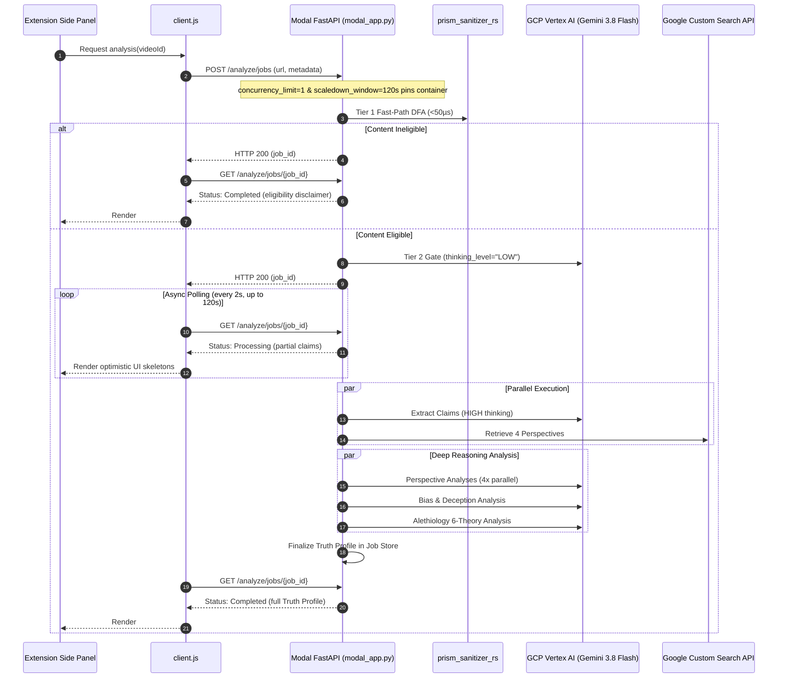

# Modal Labs & GCP Cross-Cloud Deployment Design Specification

## 1. Overview

Perspective Prism operates on a **Cross-Cloud Hybrid Architecture** designed for high-reasoning accuracy, cost efficiency, and zero server maintenance:
* **Modal Labs Tier (Serverless Compute)**: Hosts the containerized FastAPI backend, executes the compiled Rust PyO3 native core engine (`prism_sanitizer_rs`), manages asynchronous job polling state, and scales to zero when idle to conserve Modal's $30/month free-tier compute credits.
* **Google Cloud Platform Tier (Foundation Models & Search)**: Hosts Vertex AI for high-throughput Gemini 3.8 Flash model execution (under [ADR 003](file:///Users/pretermodernist/Developer/Personal/PerspectivePrism/docs/adr/003-mandatory-vertex-ai-paid-tier-and-async-io-standard.md) and [ADR 007](file:///Users/pretermodernist/Developer/Personal/PerspectivePrism/docs/adr/007-gemini-38-flash-capability-optimization.md)), along with Google Custom Search JSON API for multi-perspective evidence retrieval.
* **Client Tier (Chrome Extension)**: Manifest V3 Native Side Panel (`sidepanel.html`, `sidepanel.js`) interacting with the backend via polling, with graceful degradation to a self-hosting CTA upon credit exhaustion.

---

## 2. Architecture Constraints & Modal Integration

### 2.1 Cross-Cloud Topology & Sequence Flow



### 2.2 Compute & Scaling Configuration
* **Container Spec**: 1 vCPU core, 2 GiB Memory (`modal.App` function configuration).
* **Single-Container Routing (`concurrency_limit=1`)**: To ensure all polling requests (`GET /analyze/jobs/{job_id}`) reliably hit the exact container instance that processed `POST /analyze/jobs` and holds the process-local `jobs` dictionary, the ASGI function sets `concurrency_limit=1`. This eliminates multi-container routing splits where a poll hits a cold container with an empty job store (returning 404).
* **Concurrent Inputs (`allow_concurrent_inputs=10`)**: Routes up to 10 simultaneous HTTP requests into the warm container, matching `Settings.tier_max_concurrency=10`.
* **Bounded Keep-Warm (`scaledown_window=120`)**: Keeps the container active for 120 seconds (2 minutes) after the last request. This provides ample runway for background analysis tasks and polling loops to finish while strictly bounding idle compute cost.

### 2.3 Cross-Cloud Secret Management (Option A)
GCP credentials, search keys, and extension origins are provisioned securely via Modal Secrets:
1. **Modal Secret**: A single Modal Secret named `perspective-prism-gcp-secrets` contains:
   * `GCP_SERVICE_ACCOUNT_JSON`: The raw JSON key string of a GCP Service Account possessing `roles/aiplatform.user`.
   * `GCP_PROJECT` / `GOOGLE_CLOUD_PROJECT`: The GCP project ID.
   * `GCP_LOCATION`: `"global"` (or `"us-central1"`).
   * `GEMINI_TIER`: `"paid"`.
   * `GOOGLE_API_KEY`: Google Custom Search API key.
   * `GOOGLE_CSE_ID`: Custom Search Engine ID.
   * `CHROME_EXTENSION_IDS`: JSON array string of allowed extension IDs (e.g. `'["amnjngnkcgooljnblcejpmkdhpikcdlp"]'`), matching `pydantic-settings` native `list[str]` parsing. The backend parses this into `build_chrome_extension_regex` to dynamically permit the deployed extension.
   * `BACKEND_CORS_ORIGINS`: Comma-separated allowed web origins.
2. **Container Startup Hook**: In `backend/modal_app.py`, a startup initialization hook reads `os.environ["GCP_SERVICE_ACCOUNT_JSON"]`, writes it to `/tmp/gcp_sa.json`, and sets `os.environ["GOOGLE_APPLICATION_CREDENTIALS"] = "/tmp/gcp_sa.json"`.
3. **No AI Studio Keys**: Legacy `GEMINI_API_KEY` is completely absent, ensuring 100% compliance with [ADR 003](file:///Users/pretermodernist/Developer/Personal/PerspectivePrism/docs/adr/003-mandatory-vertex-ai-paid-tier-and-async-io-standard.md).

---

## 3. Rust Native Core Engine Compilation (ADR 001 & ADR 006)

The container image must build the PyO3 Rust extension (`prism_sanitizer_rs`) with its required system and crate dependencies.

### 3.1 Dependencies
* **System Packages**: `curl`, `build-essential`, `pkg-config`, `gcc`.
* **Rust Toolchain**: `rustup` installing stable `rustc` and `cargo`.
* **Crates**: `pyo3 = "0.29.0"`, `aho-corasick = "1.1.3"`, `unicode-normalization = "0.1.24"`, `regex`, `once_cell`.
* **Python Build Tool**: `maturin>=1.15,<2.0`.

### 3.2 Modal Image Layering Strategy
To avoid virtual environment errors associated with bare `maturin develop` commands, and to prevent literal `$PATH` truncation from `Image.env()`, the image compiles and installs `prism_sanitizer_rs` with dynamic subshell PATH expansion:

```python
image = (
    modal.Image.debian_slim(python_version="3.11")
    .apt_install("curl", "build-essential", "pkg-config", "gcc")
    .run_commands(
        "curl --proto '=https' --tlsv1.2 -sSf https://sh.rustup.rs | sh -s -- -y",
    )
    .copy_local_dir("backend/prism_sanitizer_rs", "/root/prism_sanitizer_rs")
    .run_commands(
        "PATH=\"/root/.cargo/bin:$PATH\" pip install -e /root/prism_sanitizer_rs",
    )
    .copy_local_file("backend/requirements.txt", "/root/requirements.txt")
    .run_commands(
        "grep -v 'prism_sanitizer_rs' /root/requirements.txt > /root/requirements_clean.txt",
        "pip install -r /root/requirements_clean.txt",
    )
    .copy_local_dir("backend/app", "/root/app")
)
```
This layering ensures:
1. Rust toolchain and crate compilation are cached across container builds.
2. `PATH="/root/.cargo/bin:$PATH"` is dynamically evaluated inside the shell for the `pip install` step, preserving all standard system directories (`/usr/local/bin`, `/usr/bin`, `/bin`) while exposing `cargo` and `rustc`.
3. `pip install -e /root/prism_sanitizer_rs` invokes `maturin` to compile the PyO3 extension directly into container Python without requiring an activated virtualenv.
4. Filtering `requirements.txt` prevents duplicate or conflicting editable installations.
5. Subsequent edits to `app/` do not invalidate the slow Rust compilation layer.

---

## 4. Cost & Usage Estimates

Modal Labs provides $30.00/month in free compute credits, while GCP provides billing credits for Vertex AI.

### 4.1 Compute Costs (Modal Labs)
* **1 vCPU**: ~$0.0000131 / second
* **2 GiB RAM**: ~$0.00000444 / second
* **Combined Rate**: ~$0.00001754 / second
* **Monthly Budget Capacity**: $\$30.00 / \$0.00001754/\text{s} \approx \mathbf{1,710,000\text{ container-seconds}}$ (~475 container-hours per month).

### 4.2 Workload & Duty Cycle Modeling
A realistic cost estimate must account for both active processing time and the idle keep-warm window:
* **Active Compute**:
  - Non-factual videos (<50µs fast-path): ~1.0s active compute.
  - Factual videos (Gemini 3.8 Flash high thinking): ~45–75s active compute.
  - Weighted average active time: $(0.40 \times 1.0\text{s}) + (0.60 \times 60\text{s}) \approx 36.4\text{s}$.
* **Idle Keep-Warm Time**:
  - `scaledown_window=120` seconds of keep-warm occurs after the final request of a session.
* **Isolated vs. Clustered Sessions**:
  1. **Worst-Case Isolated Requests**: If every single request occurs in complete isolation (36.4s active + 120s idle = ~156.4s billed per request):
     $$\frac{1,710,000\text{ seconds}}{156.4\text{ seconds/analysis}} \approx \mathbf{10,900\text{ analyses / month}} \text{ (~360 analyses / day)}$$
  2. **Clustered / Concurrent Usage**: When users analyze multiple videos or concurrent users share the warm container (amortizing the 120s keep-warm window across multiple requests):
     $$\frac{1,710,000\text{ seconds}}{\approx 50\text{ effective seconds/analysis}} \approx \mathbf{34,200\text{ analyses / month}} \text{ (~1,140 analyses / day)}$$
  3. **Continuous Running Cap**: Because `concurrency_limit=1` is enforced, even if the container were forced to stay warm 24/7 (86,400 seconds/day), maximum possible cost is capped at $86,400 \times 30 \times \$0.00001754 \approx \$45.47/\text{month}$. Under normal portfolio traffic with scale-to-zero active during quiet hours, total usage remains comfortably within the **$30.00 free tier**.

---

## 5. Graceful Exhaustion Mechanism (Manifest V3 Side Panel)

Because Perspective Prism is a portfolio project relying on free-tier credits, the system handles credit exhaustion gracefully without crashing the UI or misrepresenting temporary issues.

### 5.1 Differentiated Error Interception
* **Modal Credit Exhaustion**: Modal explicitly returns **HTTP 402 Payment Required** when account compute credits are depleted, or returns a payload containing `Modal error: out of credits`.
* **Transient Errors**: HTTP 429, 502, and 503 are treated as transient network or capacity events. The client executes standard exponential backoff retries and only displays a retryable connection alert if retries fail.

### 5.2 Extension Client Detection (`chrome-extension/client.js`)
`client.js` inspects failed fetch responses:
```javascript
// Differentiate unambiguous Modal quota exhaustion from transient errors
const isModalHost = this.baseUrl.includes(".modal.run");

if (response.status === 402 || (isModalHost && response.status === 429 && responseText.includes("out of credits"))) {
  const error = new HttpError(response.status, response.statusText);
  error.code = "QUOTA_EXHAUSTED";
  error.isExhaustion = true;
  throw error;
}
```

### 5.3 Native Side Panel Presentation (`sidepanel.html` / `sidepanel.js`)
The legacy in-page DOM overlay was completely excised (ADR 002). The exhaustion experience is rendered exclusively in the **Native Side Panel**:
* Side panel receives `QUOTA_EXHAUSTED` code.
* Transitions to `#state-quota-exhausted`:
  - **Header**: "Server Quota Exhausted"
  - **Message**: "Perspective Prism has reached its monthly free-tier server limit on Modal Labs. You can continue analyzing videos by easily self-hosting the backend on your own machine."
  - **CTA Button**: "View Self-Hosting Guide on GitHub" (opens `https://github.com/JAaron93/PerspectivePrism#setup-installation` in a new tab).
  - **Secondary Action**: "Open Extension Settings" (opens `options.html` to configure a self-hosted `backendUrl`).

---

## 6. Architectural Compliance & Invariants Matrix

| Architectural Invariant | Specification Compliance Mechanism |
| :--- | :--- |
| **ADR 001 / ADR 006 (Rust Native Core)** | Container image compiles `prism_sanitizer_rs` with `maturin` via `pip install -e` in a subshell preserving system PATH. Fast-path Aho-Corasick DFA and prompt nonces run in native code without virtualenv or PATH errors. |
| **ADR 002 / ADR 004 (Side Panel & Zero-Build)** | UI is 100% Native Side Panel (`sidepanel.html`). Client and side panel scripts use zero-build vanilla JS typed via ambient JSDoc. |
| **ADR 003 (100% GCP Vertex AI Mode)** | Modal Secret injects GCP Service Account JSON key (`GOOGLE_APPLICATION_CREDENTIALS`). AI Studio keys (`GEMINI_API_KEY`) are permanently barred. |
| **ADR 005 (Pre-Classifier & Alethiology)** | Pipeline includes sub-millisecond eligibility screening and 6-theory epistemic truth evaluation with dynamic delimiter nonces. |
| **ADR 007 (Gemini 3.8 Flash Optimization)** | Primary analytical models run with `thinking_level="HIGH"`, 64K token ceilings, and 120s HTTP timeout runway. Polling loop and client timeout support 120s runway. |
