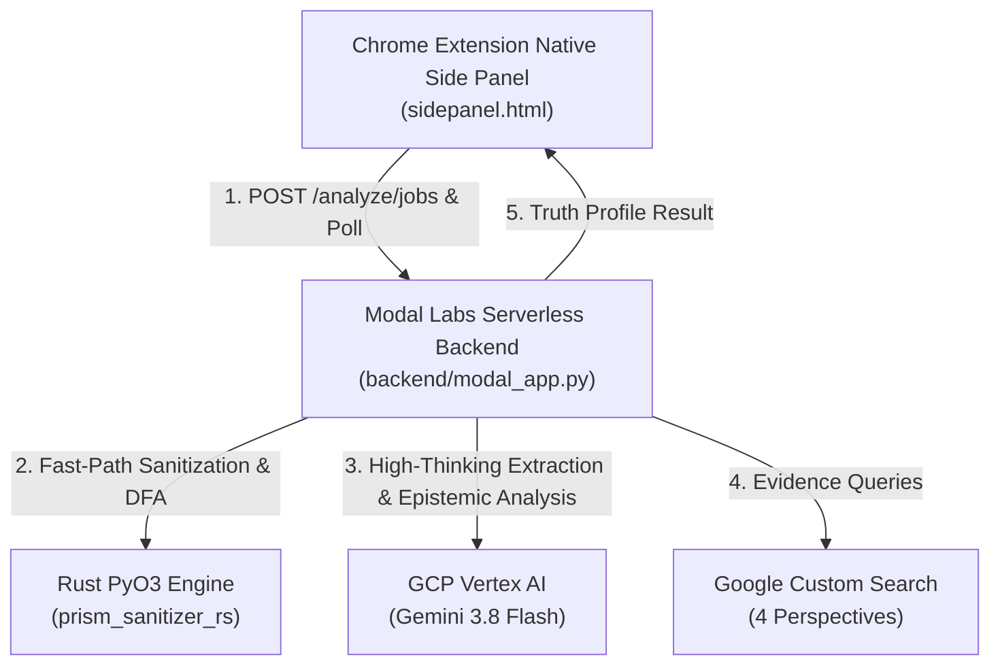

# Modal Labs & GCP Cross-Cloud Deployment Guide

This guide details the complete deployment workflow for Perspective Prism's backend on **Modal Labs serverless compute**, integrating with **Google Cloud Platform (GCP) Vertex AI** for high-throughput foundation model execution under [ADR 003](adr/003-mandatory-vertex-ai-paid-tier-and-async-io-standard.md) and [ADR 007](adr/007-gemini-38-flash-capability-optimization.md).

---

## 1. Architecture Overview

Perspective Prism operates on a **Cross-Cloud Hybrid Topology**:
* **Modal Labs Tier (Serverless Compute)**: Hosts the containerized FastAPI backend (`backend/modal_app.py`), compiles and executes the high-performance native Rust core engine (`prism_sanitizer_rs` via PyO3/Maturin), manages asynchronous in-memory polling jobs (`/analyze/jobs`), and scales down to zero after 120 seconds of inactivity to conserve free-tier compute credits.
* **Google Cloud Platform Tier (Foundation Models & Search)**: Direct authenticated connection to GCP Vertex AI for Gemini 3.8 Flash (`thinking_level="HIGH"`, 64K ceiling), with Google Custom Search JSON API for multi-perspective evidence retrieval.
* **Client Tier (Chrome Extension)**: Manifest V3 Native Side Panel communicating with the deployed Modal URL via asynchronous job polling, with graceful degradation to `#state-quota-exhausted` when free-tier server credits are depleted.



---

## 2. Prerequisites

1. **Modal Account**: Sign up at [modal.com](https://modal.com) (includes $30.00/month in free compute credits).
2. **Google Cloud Platform Account**:
   - Active GCP Project with billing enabled (for Vertex AI 300+ RPM quota).
   - Vertex AI API enabled:
     ```bash
     gcloud services enable aiplatform.googleapis.com
     ```
3. **Google Custom Search Credentials**:
   - Google Custom Search JSON API key (`GOOGLE_API_KEY`).
   - Programmable Search Engine ID (`GOOGLE_CSE_ID`).
4. **Local Tools**:
   - Python 3.10+ with `pip`.
   - Google Cloud SDK (`gcloud`).

---

## 3. Step-by-Step Deployment

### Step 1: Install & Authenticate Modal CLI

Install the Modal CLI in your local Python environment and run authentication:

```bash
pip install modal
modal setup
```

This opens your web browser to authenticate your local machine with your Modal account.

---

### Step 2: Create GCP Service Account & Export Credentials

Create a dedicated Google Cloud Service Account possessing the Vertex AI User role (`roles/aiplatform.user`):

```bash
# Set your GCP Project ID
export GCP_PROJECT_ID="your-gcp-project-id"

# 1. Create service account
gcloud iam service-accounts create perspective-prism-backend \
    --project="${GCP_PROJECT_ID}" \
    --description="Service account for Perspective Prism Modal serverless container" \
    --display-name="Perspective Prism Backend"

# 2. Grant Vertex AI User role
gcloud projects add-iam-policy-binding "${GCP_PROJECT_ID}" \
    --member="serviceAccount:perspective-prism-backend@${GCP_PROJECT_ID}.iam.gserviceaccount.com" \
    --role="roles/aiplatform.user"

# 3. Export JSON key file to a secure temporary path
gcloud iam service-accounts keys create /tmp/gcp_sa.json \
    --iam-account="perspective-prism-backend@${GCP_PROJECT_ID}.iam.gserviceaccount.com"
```

> [!CAUTION]
> **Secret Hygiene**: Never commit `/tmp/gcp_sa.json` to git. Modal Secrets will securely store this key and inject it directly into the serverless container's memory at runtime.

---

### Step 3: Create Modal Secret (`perspective-prism-gcp-secrets`)

Configure the Modal Secret holding all cross-cloud credentials.

> [!IMPORTANT]
> **Configuration Security & Formatting**:
> - `CHROME_EXTENSION_IDS` MUST be passed as a valid JSON array string (e.g. `'["amnjngnkcgooljnblcejpmkdhpikcdlp"]'`). Chrome extension contexts are granted browser cross-origin access via FastAPI's `allow_origin_regex` matching `chrome-extension://<id>` (CORS governs browser origin policy, not API endpoint authentication).
> - **Never set `BACKEND_CORS_ORIGINS="*"`**: Wildcard CORS opens the unauthenticated `/analyze/jobs` endpoint to any website on the internet, allowing third-party web pages to submit jobs and burn your cloud compute allowance. Only specify authorized web frontend domains (e.g. `'["http://localhost:5173"]'`).
> - `PROBE_SECRET` MUST be a cryptographically secure random token generated by the deployer (e.g. via `openssl rand -hex 32`). Never use shared or published placeholder values, as anyone with the key can trigger live Vertex AI billing probes.

```bash
# Generate a unique cryptographically strong probe secret
PROBE_SECRET="$(openssl rand -hex 32)"

modal secret create perspective-prism-gcp-secrets \
    GCP_SERVICE_ACCOUNT_JSON="$(cat /tmp/gcp_sa.json)" \
    GCP_PROJECT="${GCP_PROJECT_ID}" \
    GCP_LOCATION="global" \
    GEMINI_TIER="paid" \
    GOOGLE_API_KEY="YOUR_GOOGLE_SEARCH_API_KEY" \
    GOOGLE_CSE_ID="YOUR_GOOGLE_SEARCH_ENGINE_ID" \
    CHROME_EXTENSION_IDS='["YOUR_CHROME_EXTENSION_ID"]' \
    BACKEND_CORS_ORIGINS='["http://localhost:5173"]' \
    PROBE_SECRET="${PROBE_SECRET}"
```

Once the secret is created, securely delete your local key file:

```bash
rm -f /tmp/gcp_sa.json
```

---

### Step 4: Deploy Backend to Modal Labs

Deploy the serverless FastAPI backend using `backend/modal_app.py`:

```bash
# From the repository root
modal deploy backend/modal_app.py
```

For live local development with hot reload:

```bash
modal serve backend/modal_app.py
```

Upon successful deployment, Modal outputs your public HTTPS endpoint:

```
✓ Created objects.
├── 🔨 Created function fastapi_app.
└── 🚀 Deployed app perspective-prism-backend to:
    https://<workspace-name>--perspective-prism-backend-fastapi-app.modal.run
```

#### How the Container Works
- **Rust Engine Compilation**: `modal.Image.debian_slim` automatically installs the Rust toolchain via `rustup` and compiles `backend/prism_sanitizer_rs` with `maturin` in a dynamic subshell preserving system `PATH`.
- **Single-Container Routing (`max_containers=1`)**: Guarantees that asynchronous status polls (`GET /analyze/jobs/{job_id}`) route to the exact container holding the in-memory job store, preventing 404 lookup failures.
- **Concurrency & Keep-Warm**: Configured with `@modal.concurrent(max_inputs=10)` to process multiple requests concurrently within the container, and `scaledown_window=120` to keep the container warm through long high-thinking analysis cycles before scaling down to zero when idle.

---

### Step 5: Verify Deployment with Health Probes

Test basic liveness:

```bash
curl -s https://<workspace-name>--perspective-prism-backend-fastapi-app.modal.run/health | jq
```

Expected output:
```json
{
  "status": "healthy"
}
```

Verify live outbound GCP Vertex AI authentication and Gemini 3.8 Flash model reachability:

```bash
# If PROBE_SECRET was configured:
curl -s -H "X-Probe-Key: <PROBE_SECRET>" \
  "https://<workspace-name>--perspective-prism-backend-fastapi-app.modal.run/health/llm?probe=true" | jq

# Expected output:
# {
#   "primary_model": "gemini-3.8-flash",
#   "gemini_tier": "paid",
#   "max_concurrency": 10,
#   "circuit_breaker_open": false,
#   "features": {
#     "backup_configured": true,
#     "failures_count": 0
#   },
#   "probe": {
#     "success": true,
#     "model": "gemini-3.8-flash",
#     "total_tokens": 4
#   },
#   "status": "healthy",
#   "message": "Primary provider operational."
# }
```

---

### Step 6: Configure the Chrome Extension

1. In Google Chrome, navigate to `chrome://extensions/`.
2. Find **Perspective Prism** and click **Details** -> **Extension options** (or click the Settings gear icon inside the Side Panel).
3. In the **Backend URL** field, enter your deployed Modal HTTPS URL:
   ```
   https://<workspace-name>--perspective-prism-backend-fastapi-app.modal.run
   ```
4. Click **Test Connection**. A green `✓ Connected successfully` badge will appear.
5. Click **Save Settings**.

---

## 4. Quota Exhaustion & Self-Hosting Fallback (FR6 & FR7)

Because Perspective Prism operates within Modal Labs' free-tier allowance ($30/month compute credits):
* **Credit Exhaustion Detection**: If monthly compute credits are exhausted, Modal returns **HTTP 402 Payment Required** or an HTTP 429 response containing `"out of credits"`.
* **Client Interception**: The Chrome extension (`client.js`) intercepts this response, assigns structured error code `QUOTA_EXHAUSTED`, and suppresses retries.
* **Native Side Panel UI**: The Side Panel transitions to `#state-quota-exhausted`, presenting:
  1. A clear message explaining that free-tier server credits on Modal Labs have been reached.
  2. A primary CTA button linking directly to the [Self-Hosting Guide](../README.md#setup-installation) on GitHub.
  3. A button to open Extension Settings (`options.html`) to connect to a local or custom backend.

---

## 5. Troubleshooting & Maintenance

| Symptom | Cause | Resolution |
| :--- | :--- | :--- |
| `pydantic_core._pydantic_core.ValidationError: CHROME_EXTENSION_IDS` | `CHROME_EXTENSION_IDS` in Modal Secret was formatted as a raw string instead of a JSON array. | Recreate or update secret using `'["<id>"]'`. |
| `HTTP 401 Unauthorized` on `/health/llm?probe=true` | `PROBE_SECRET` is set on backend, but `X-Probe-Key` header was omitted or mismatched. | Pass matching `X-Probe-Key` header in request. |
| Polling returns `404 Job not found` | Multi-container scaling routing poll to a different container instance. | Verify `max_containers=1` is set in `backend/modal_app.py`. |
| `prism_sanitizer_rs` compilation fails in Modal build | `PATH` did not include Cargo binaries during `pip install -e`. | Ensure image runs `PATH="/root/.cargo/bin:$PATH" pip install -e ...` in subshell. |
