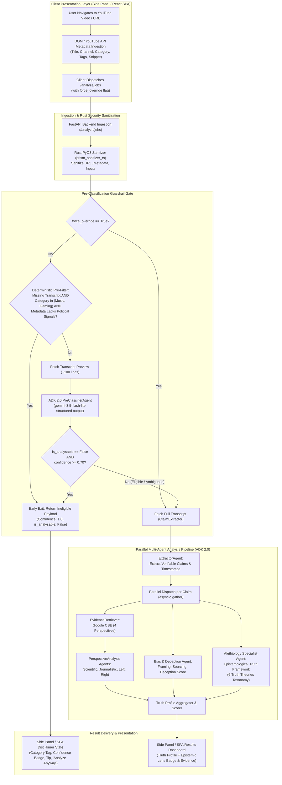

# Pre-Classification Gate & Alethiology Specialist Agent Design Specification

## 1. Executive Summary & Problem Context

Perspective Prism is an intelligent YouTube video analysis platform running a multi-agent pipeline orchestrated with **Google ADK 2.0** and **Gemini 3.x Flash Lite** (in GCP Vertex AI mode). Currently, the pipeline directly triggers full transcript extraction, multi-perspective Google Custom Search queries (Scientific, Journalistic, Partisan Left, Partisan Right), stance evaluations, and bias/deception scoring on any submitted YouTube URL.

This introduces two distinct architectural opportunities:
1. **Inefficient Processing on Non-Analytical Videos**: Submitting music videos, anime music videos (AMVs), video game speedruns, fashion runway shows, cooking demos, or ASMR streams to the deep political and factual claim extraction pipeline wastes API tokens, adds unnecessary latency, and risks forcing LLMs to hallucinate political or factual claims where none exist.
2. **Lack of Epistemological Depth**: Existing bias detection identifies framing, sourcing, and deception, but fails to capture the underlying *theory of truth* (alethiology) that a speaker operates under (e.g. why an empirical scientist relying on correspondence theory talks past an ideological commentator relying on narrative coherence).

This specification details two major system enhancements:
- **Pre-Classification Guardrail Gate**: A fast, multi-signal classification gate that screens video metadata and transcript previews to early-exit non-analytical content with a friendly side panel disclaimer while offering a user force-override ("Analyze Anyway").
- **Alethiology Specialist Agent**: A concurrent ADK 2.0 agent that objectively classifies the speaker's implicit epistemological truth framework across six defined philosophical theories without passing normative judgments.

---

## 2. System Architecture & End-to-End Pipeline



---

## 3. Component Deep Dives

### 3.1 Pre-Classification Guardrail Gate (`PreClassifierService`)

The Pre-Classification Gate prevents non-analytical media from triggering costly downstream claim extraction and web searches.

#### 3.1.1 Multi-Signal Detection Inputs
The classifier synthesizes two distinct signal streams:
1. **YouTube Metadata**:
   - Video Title and Channel Name.
   - YouTube Category ID and Name (e.g. *Music*, *Gaming*, *Entertainment*, *Howto & Style* vs. *News & Politics*, *Education*, *Society & Culture*).
   - Video Tags and Description Preview (first 250 characters).
2. **Transcript Preview**:
   - First 50–100 lines of spoken transcript (empty string `""` if no captions exist).

#### 3.1.2 Fast Deterministic Pre-Filter (Zero-Token Early Exit)
To avoid unnecessary LLM calls and achieve sub-10ms response times for obvious non-analytical content while guarding against premature false rejections:
- **Condition for Deterministic Exit**:
  1. `transcript is None or transcript.strip() == ""` (no speech captions available), **AND**
  2. The YouTube Category is explicitly `Music` or `Gaming`, **AND**
  3. The video metadata (`title`, `channel_name`, `tags`, `description_snippet`) contains **NO** political, electoral, policy, or socio-economic keywords (e.g., does not contain words like *election*, *debate*, *ruling*, *senator*, *policy*, *strike*, *court*, *war*, *economy*).
- When all three conditions match, the service immediately short-circuits with:
  ```json
  {
    "is_analysable": false,
    "confidence_score": 1.0,
    "detected_category": "Music / Non-Speech Media",
    "disclaimer_title": "No Spoken Commentary Found",
    "disclaimer_message": "This video contains no speech captions and belongs to an entertainment/music category with no socio-political discourse in its metadata. Perspective Prism requires spoken claims to analyze.",
    "key_topics_found": []
  }
  ```
- **Handling Missing Captions with Analytical Metadata**: If a video in `Music` or `Gaming` lacks captions but its title or metadata contains political or socio-economic terms (e.g., `"[AMV] Election 2024"`, `"Geoguessr Stream - Talking about Supreme Court ruling"`), it is **NOT** discarded by the fast path. Instead, it proceeds to the `PreClassifierAgent` to evaluate metadata, ensuring edge cases are properly categorized and allowing user force-override rather than falsely asserting 1.0 confidence of non-political content.

#### 3.1.3 ADK 2.0 Pre-Classifier Agent Specification
- **Agent Name**: `pre_classifier_agent_primary` (with fallback to `pre_classifier_agent_backup`).
- **Model**: `gemini-3.5-flash-lite` (Vertex AI mode), fallback to `gemini-3.1-flash-lite`.
- **Structured Output Schema**: `ContentEligibilityResult` (Pydantic model).
- **Conservative Threshold Rule**: If `is_analysable == False` but `confidence_score < 0.70`, the system treats the result as ambiguous and defaults to **allowing analysis** (`is_analysable = True`).

#### 3.1.4 Critical Edge-Case Prompt Calibration
The agent system prompt incorporates strict few-shot examples targeting known failure modes:
1. **Political Satire & Late-Night Comedy**: Must be classified as `is_analysable = True` because humorous framing conveys ideological claims and rhetorical bias.
2. **Political AMVs & Meme Edits**: Must evaluate spoken audio/transcript over visual tags. If audio features political speeches, debates, or news clips over anime visuals $\rightarrow$ `is_analysable = True`.
3. **Documentaries & Historical/Tech Policy Essays**: Videos categorized under `Education` or `Science & Technology` discussing regulation, economic history, or geopolitics $\rightarrow$ `is_analysable = True`.
4. **News-Adjacent Gaming / Casual Commentary**: Streamers discussing elections, Supreme Court rulings, or foreign policy while playing video games $\rightarrow$ `is_analysable = True`. Pure gameplay speedruns or mechanical walkthroughs $\rightarrow$ `is_analysable = False`.

---

### 3.2 Alethiology Specialist Agent (`AlethiologyService`)

The Alethiology Specialist Agent evaluates the implicit epistemological definition of truth used by the speaker.

#### 3.2.1 Epistemological Taxonomy (6 Core Truth Theories)
The agent classifies statements against the following mutually exclusive philosophical frameworks:

| Truth Theory | Core Epistemological Premise | Typical YouTube Context | Key Linguistic Markers |
| :--- | :--- | :--- | :--- |
| **Correspondence (Empirical)** | A claim is true if and only if it directly matches objective, physical, or historical facts. | Science communication, investigative journalism, lab reporting, data fact-checking. | *"The data shows...", "Raman spectroscopy confirmed...", "Here is the raw footage..."* |
| **Coherence (Systemic Narrative)** | A claim is true if it fits logically without contradiction into a larger belief system or narrative worldview. | Ideological essays, systemic critiques, partisan commentary, conspiracy analyses. | *"This fits the exact pattern...", "If you understand the system, this connects back to..."* |
| **Pragmatic (Practical Utility)** | A claim or policy is true/valid because holding it produces effective, practical real-world results. | Tech/startup commentary, self-help, business strategy, campaign mechanics. | *"Whatever works in practice...", "At the end of the day, results speak for themselves..."* |
| **Perspectivism (Lived Experience)** | Truth cannot be separated from the observer's vantage point, identity, or lived experience. | Cultural critique essays, standpoint epistemology vlogs, post-colonial analyses. | *"Speaking from my lived experience...", "Through the lens of...", "Their lived reality..."* |
| **Consensus (Institutional Agreement)** | Truth is what an established community, accredited expert body, or peer group agrees upon. | Institutional news briefings, peer-reviewed climate reports, official press releases. | *"The peer-reviewed consensus states...", "Over 200 lead authors agree..."* |
| **Deflationary (Rhetorical Endorsement)** | Claiming "X is true" is merely a performative speech act used to endorse, agree, or build rapport. | Live debate reactions, conversational podcasts, hype commentary. | *"Bro, facts! That is so true!", "100% facts right there", "Couldn't agree more"* |

#### 3.2.2 Strict Descriptive Neutrality Guardrail
- **Absolute Non-Judgment Rule**: The agent MUST remain strictly descriptive. It is strictly prohibited from evaluating whether a truth theory is "better", "more rational", "sound", or "scientific".
- **No Fallacy Accusations**: The agent must not accuse speakers of fallacies or falsehoods. For example, conspiracy theories are classified as **Coherence (Systemic Narrative)** because they assemble disparate points into a coherent web, without labeling the speaker as "delusional" or "fake news".

#### 3.2.3 Concurrency & Pipeline Placement
The Alethiology Agent executes **in parallel** (`asyncio.gather`) alongside `PerspectiveAnalysis` and `BiasAnalysis` for each extracted claim (or at the video transcript level), adding **0ms net wall-clock overhead** to the backend analysis pipeline.

---

### 3.3 Chrome Side Panel UX & User Flows

#### 3.3.1 Pre-Classification Ineligible State
When a video is determined to be non-analytical, the Side Panel transitions into the `#state-ineligible` view:
- **Visual Pill / Tag**: `Anime Music Video (AMV) • 96% Non-Political` (rendered with muted amber styling).
- **Disclaimer Title**: `No Political Analysis Needed` or `Analysis Skipped`.
- **Explanation Body**: Clean paragraph explaining why the pipeline paused.
- **Actionable Tip**: *"Tip: Navigate to a news report, documentary, or political commentary video to use Perspective Prism."*
- **"Analyze Anyway" (Force Override Button)**: Allows the user to bypass the gate and force a full multi-agent analysis (`force_override: true`).

```
+---------------------------------------------------+
| Perspective Prism                      [ ⚙️ Settings ] |
+---------------------------------------------------+
|                                                   |
|  [ ⚠️ ] Analysis Skipped                          |
|  [ Badge: Anime Music Video (AMV) • 96% Match ]   |
|                                                   |
|  "This video appears to be a music video/AMV and  |
|   does not contain political discourse, news, or  |
|   verifiable policy claims."                      |
|                                                   |
|  -----------------------------------------------  |
|  Tip: Navigate to a news broadcast or commentary  |
|  video to run full multi-perspective analysis.    |
|                                                   |
|  +---------------------------------------------+  |
|  |  [⚡ Analyze Anyway] (Force Override)        |  |
|  +---------------------------------------------+  |
+---------------------------------------------------+
```

#### 3.3.2 Epistemic Lens UI Component in Results Dashboard
When analysis completes, each claim's Truth Profile (or the global video summary) displays an interactive **Epistemic Lens** section:
- **Primary Lens Chip**: e.g., `[ 🔭 Epistemic Lens: Correspondence (Empirical) ]` or `[ 🕸️ Epistemic Lens: Coherence (Systemic Narrative) ]`.
- **Secondary Lens Chip** (if detected): e.g., `[ Supporting: Consensus (Institutional) ]`.
- **Epistemic Summary**: 2–3 sentence neutral explanation of *how* the speaker constructs their case.
- **Quote Evidence Accordion**: Expandable quotes from the transcript illustrating the epistemological posture.

---

## 4. Data Models & Schemas

### 4.1 Python / Pydantic Backend Schemas (`app/models/schemas.py`)

```python
from enum import Enum
from typing import Dict, List, Optional, Literal
from pydantic import BaseModel, Field, HttpUrl

TruthTheoryType = Literal[
    "Correspondence (Empirical)",
    "Coherence (Systemic Narrative)",
    "Pragmatic (Practical Utility)",
    "Perspectivism (Lived Experience)",
    "Consensus (Institutional Agreement)",
    "Deflationary (Rhetorical Endorsement)"
]

class VideoMetadata(BaseModel):
    title: str = Field(default="", description="YouTube video title")
    channel_name: str = Field(default="", description="Channel or creator name")
    category_id: Optional[str] = Field(default=None, description="YouTube Category ID")
    category_name: Optional[str] = Field(default=None, description="Category name (e.g. News & Politics, Music)")
    tags: List[str] = Field(default_factory=list, description="Video tags/keywords")
    description_snippet: str = Field(default="", description="First 250 characters of description")

class VideoRequest(BaseModel):
    url: HttpUrl
    force_override: bool = Field(
        default=False, 
        description="When True, bypasses the Pre-Classification guardrail gate and forces full analysis."
    )
    metadata: Optional[VideoMetadata] = Field(
        default=None, 
        description="Client-extracted YouTube DOM metadata to assist pre-classification."
    )

class ContentEligibilityResult(BaseModel):
    is_analysable: bool = Field(
        description="True if video contains political discourse, news, commentary, debate, or socio-economic claims."
    )
    confidence_score: float = Field(
        ge=0.0, le=1.0, 
        description="Confidence level between 0.0 and 1.0 that classification is correct."
    )
    detected_category: str = Field(
        description="2-3 word label for detected content type (e.g. 'Anime Music Video', 'Political Commentary')."
    )
    disclaimer_title: str = Field(
        description="Short user-facing header if is_analysable is False (e.g. 'Analysis Skipped')."
    )
    disclaimer_message: str = Field(
        description="Clear, respectful explanation of why analysis was skipped."
    )
    key_topics_found: List[str] = Field(
        default_factory=list, 
        description="Brief list of top topics identified in the metadata/transcript."
    )

class AlethiologyAnalysis(BaseModel):
    primary_theory: TruthTheoryType = Field(
        description="Dominant epistemological theory of truth the speaker operates on."
    )
    secondary_theory: Optional[TruthTheoryType] = Field(
        default=None, 
        description="Supporting or secondary truth framework present in the transcript."
    )
    epistemic_summary: str = Field(
        description="Strictly neutral 2-3 sentence explanation of HOW the speaker builds their case."
    )
    quote_evidences: List[str] = Field(
        default_factory=list, 
        description="Exact transcript quotes where speaker demonstrates their truth assumptions."
    )

class ClientTruthProfile(BaseModel):
    overall_assessment: str
    perspectives: Dict[str, PerspectiveAnalysis]
    bias_indicators: BiasIndicators
    alethiology: Optional[AlethiologyAnalysis] = Field(
        default=None, 
        description="Epistemological truth framework analysis for the claim or transcript."
    )

class AnalysisResponse(BaseModel):
    video_id: str
    metadata: AnalysisMetadata
    eligibility: Optional[ContentEligibilityResult] = Field(
        default=None, 
        description="Content eligibility evaluation from the pre-classifier gate."
    )
    claims: List[ClientClaimAnalysis] = Field(default_factory=list)
```

---

### 4.2 TypeScript Ambient & Frontend Interfaces (`chrome-extension/globals.d.ts` & `frontend/src/types/`)

```typescript
export type TruthTheoryType = 
  | "Correspondence (Empirical)"
  | "Coherence (Systemic Narrative)"
  | "Pragmatic (Practical Utility)"
  | "Perspectivism (Lived Experience)"
  | "Consensus (Institutional Agreement)"
  | "Deflationary (Rhetorical Endorsement)";

export interface VideoMetadata {
  title: string;
  channel_name: string;
  category_id?: string;
  category_name?: string;
  tags?: string[];
  description_snippet?: string;
}

export interface ContentEligibilityResult {
  is_analysable: boolean;
  confidence_score: number;
  detected_category: string;
  disclaimer_title: string;
  disclaimer_message: string;
  key_topics_found: string[];
}

export interface AlethiologyAnalysis {
  primary_theory: TruthTheoryType;
  secondary_theory?: TruthTheoryType | null;
  epistemic_summary: string;
  quote_evidences: string[];
}

export interface ClientTruthProfile {
  overall_assessment: string;
  perspectives: Record<string, PerspectiveAnalysis>;
  bias_indicators: BiasIndicators;
  alethiology?: AlethiologyAnalysis;
}

export interface AnalysisResponse {
  video_id: string;
  metadata: AnalysisMetadata;
  eligibility?: ContentEligibilityResult;
  claims: ClientClaimAnalysis[];
}
```

---

## 5. Security, Hygiene & Performance Invariants

1. **Rust PyO3 Sanitizer Invariant**: All incoming metadata fields (`title`, `channel_name`, `tags`, `description_snippet`) and transcript snippets MUST pass through `input_sanitizer.py` / `prism_sanitizer_rs` to prevent prompt injection and XSS before invoking the LLM or updating the DOM.
2. **Strict Async Non-Blocking I/O**: LLM generation uses `client.aio.models` via Google ADK 2.0. Concurrency is bounded by `analysis_service.max_concurrency` via `asyncio.Semaphore`.
3. **Zero-Latency Optimistic UI**: On cache miss, the Side Panel immediately renders 4 skeleton shimmer cards (<50ms). If the Pre-Classifier flags the video as ineligible, the shimmer seamlessly morphs into the disclaimer state.
4. **BYOK Storage Isolation**: User preferences and force-override history are stored exclusively in `chrome.storage.local`.
5. **IPC Origin Verification**: Service worker `background.js` verifies `sender.id === chrome.runtime.id` on all incoming messages.
