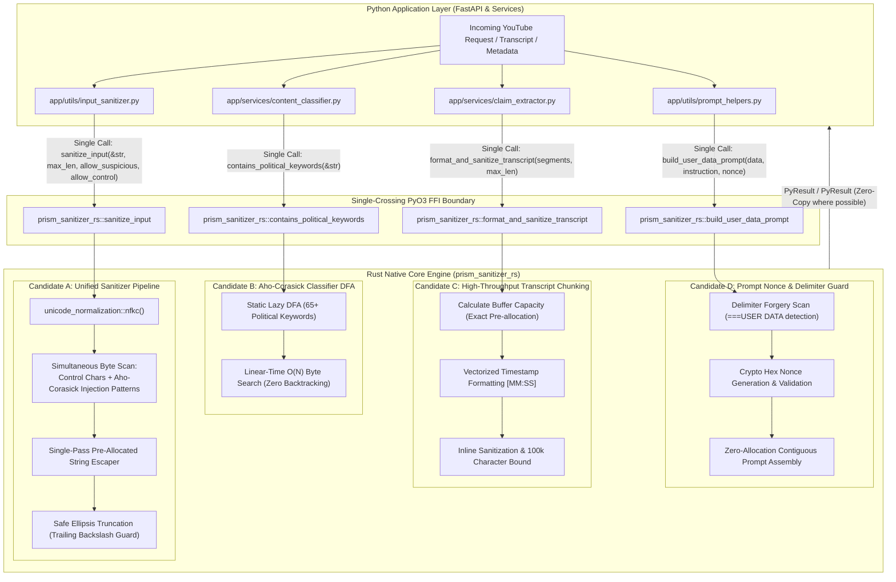

# Rust Native Core Engine & Latency Optimization Design Specification

## 1. Executive Summary & Problem Context

Perspective Prism analyzes YouTube video transcripts, claims, and biases using an asynchronous architecture combining **FastAPI**, **Google ADK 2.0**, and **Gemini 3.x Flash Lite** (in GCP Vertex AI mode). To ensure protection against prompt injection attacks and delimiter forgery, every untrusted input (claims, search evidence, user metadata, and transcripts up to 100,000 characters) must be aggressively sanitized, normalized, escaped, and checked for malicious instructions.

While high-level orchestrations (ADK agents, Google Custom Search API requests, and FastAPI lifespan jobs) are I/O-bound, the **text processing, regex scanning, and multi-pattern matching hot paths are CPU-bound**. In the current architecture:
1. **Chatty FFI Roundtrips in Input Sanitization (Candidate A)**:
   The existing PyO3 module (`prism_sanitizer_rs`) exposes micro-primitives (`contains_control_characters`, `contains_suspicious_patterns`, and `escape_special_characters`). For every string processed, Python executes **three separate FFI round-trips** across the PyO3 boundary, interleaved with Python-level whitespace trimming, `unicodedata.normalize("NFKC")`, validation checks, and character-by-character reverse iteration in `truncate_text`. On large transcripts (up to 100k characters), this introduces measurable Python memory allocations and GIL contention.
2. **Backtracking Regex Pattern Matching in Zero-Token Fast-Path (Candidate B)**:
   The Pre-Classification Guardrail Gate (`evaluate_deterministic_fast_path` in `content_classifier.py`) evaluates 65+ political and socio-economic keywords against incoming video titles, channel names, tags, and description snippets using Python's backtracking `re` module.
3. **Quadratic Memory Allocations in Transcript Formatting (Candidate C)**:
   In `ClaimExtractor.extract_claims()` (`claim_extractor.py`), YouTube transcripts containing thousands of `TranscriptSegment` objects are formatted using repeated string concatenation (`+=`) in a Python loop before being passed to `sanitize_input()`, triggering quadratic buffer reallocations.

This specification details the design for expanding `prism_sanitizer_rs` into a unified **Rust Native Core Engine**:
- **Candidate A: Full-Pipeline Unified Sanitizer**: A single-pass Rust function `sanitize_input()` performing NFKC normalization, control-character validation, suspicious pattern detection, character escaping, and backslash-aware ellipsis truncation in a single FFI crossing.
- **Candidate B: Aho-Corasick Multi-Pattern Classifier**: A compiled Aho-Corasick Deterministic Finite Automaton (DFA) matching 65+ keywords simultaneously in \(O(N)\) time across raw UTF-8 bytes.
- **Candidate C: Native Transcript Segment Processor**: A vectorized transcript formatter calculating capacity upfront, assembling `[MM:SS] text\n` timestamp lines, sanitizing text, and truncating at 100,000 characters in a single memory allocation.
- **Candidate D: Prompt Nonce & Delimiter Isolation Guard**: An inline delimiter verification and prompt builder that detects forged delimiter tokens (`===USER DATA`) and assembles nonced prompt blocks with zero quadratic string concatenation.

---

## 2. System Architecture & Component Interactions



---

## 3. Detailed Component Designs

### Component 1: Candidate A — Full-Pipeline Unified Sanitizer

#### Current Inefficiency
The current Python implementation in `app/utils/input_sanitizer.py`:
```python
def sanitize_input(text, max_length, field_name="input", ...):
    text = text.strip()
    text = unicodedata.normalize("NFKC", text)           # Python CPU
    if not allow_control_chars and contains_control_characters(text):  # FFI Call 1
        raise SanitizationError(...)
    if not allow_suspicious_patterns and contains_suspicious_patterns(text): # FFI Call 2
        raise SanitizationError(...)
    sanitized = escape_special_characters(text)          # FFI Call 3
    return truncate_text(sanitized, max_length)          # Python reverse loop
```

#### Rust Design
In `prism_sanitizer_rs`, expose:
```rust
#[pyfunction]
#[pyo3(signature = (text, max_length, allow_suspicious_patterns=false, allow_control_chars=false))]
pub fn sanitize_input(
    text: &str,
    max_length: usize,
    allow_suspicious_patterns: bool,
    allow_control_chars: bool,
) -> PyResult<String>
```

#### Execution Logic
1. **Trim & NFKC Normalization**:
   - Strip leading/trailing whitespace.
   - If empty after trim, raise `SanitizationError("input cannot be empty")`.
   - Apply `unicode_normalization::UnicodeNormalization::nfkc`.
2. **Control Character Scan**:
   - If `!allow_control_chars`, scan bytes using regex `[\p{C}&&[^\t\n\r]]`.
   - If match found, raise `SanitizationError("input contains invalid control characters")`.
3. **Suspicious Pattern Scan**:
   - If `!allow_suspicious_patterns`, scan using the compiled Aho-Corasick or Regex pattern matcher.
   - If match found, raise `SanitizationError("input contains suspicious patterns")`.
4. **Escaping & Capacity Pre-allocation**:
   - Pre-allocate a `String` with capacity `text.len() + 32`.
   - Normalize line breaks (`\r\n` and `\r` to `\n`).
   - Escape quotes (`"` to `\"`, `'` to `\'`), braces (`{` to `\{`, `}` to `\}`), and backslashes (`\` to `\\`).
5. **Backslash-Safe Truncation**:
   - If `sanitized.chars().count() <= max_length`, return as is.
   - Truncate at character boundary `max_length - 3`.
   - Check if the truncated slice ends with an odd number of consecutive backslashes (`\`). If so, drop the trailing backslash to prevent escaping the ellipsis.
   - Append `"..."`.

---

### Component 2: Candidate B — Aho-Corasick Fast-Path Pre-Classifier

#### Current Inefficiency
In `app/services/content_classifier.py`, `_KEYWORD_PATTERN` is a regex compiled from 65 keywords:
```python
_KEYWORD_PATTERN = re.compile(r'\b(' + '|'.join(re.escape(kw) for kw in POLITICAL_KEYWORDS) + r')\b', re.IGNORECASE)
```
Python's `re` engine iterates sequentially across input strings with backtracking.

#### Rust Design
Using the standard `aho-corasick` crate (authored by BurntSushi):
```rust
use aho_corasick::{AhoCorasick, AhoCorasickBuilder, MatchKind};
use once_cell::sync::Lazy;

static POLITICAL_AUTOMA: Lazy<AhoCorasick> = Lazy::new(|| {
    let keywords = [
        "election", "electoral", "politics", "political", "policy", "policies",
        "senator", "senate", "congress", "congressional", "president", "presidential",
        "candidate", "vote", "voting", "voter", "ballot", "democrat", "democratic",
        "republican", "gop", "court", "supreme court", "scotus", "judge", "justice",
        "ruling", "law", "lawsuit", "legislation", "legislative", "bill", "statute",
        "amendment", "constitution", "constitutional", "war", "conflict", "military",
        "sanction", "sanctions", "treaty", "economy", "economic", "inflation",
        "recession", "gdp", "tax", "taxes", "taxation", "tariff", "tariffs",
        "strike", "union", "protest", "protests", "protester", "riot", "scandal",
        "corruption", "geopolitics", "geopolitical", "foreign policy", "propaganda",
        "ideology", "activism", "activist", "lobbying", "lobbyist"
    ];
    AhoCorasickBuilder::new()
        .ascii_case_insensitive(true)
        .match_kind(MatchKind::LeftmostFirst)
        .build(keywords)
        .expect("Failed to build AhoCorasick automaton")
});

#[pyfunction]
pub fn contains_political_keywords(text: &str) -> bool {
    POLITICAL_AUTOMA.find(text).is_some()
}
```

#### Word-Boundary Handling
To prevent false-positive substring collisions (e.g. "policymaker" matching "policy" is desirable, but "assessment" matching "assess" must be controlled), the automaton can match against word boundaries or utilize word tokenization before pattern lookup.

---

### Component 3: Candidate C — Native Transcript Segment Processor

#### Current Inefficiency
In `app/services/claim_extractor.py`:
```python
formatted_transcript = ""
for seg in transcript.segments:
    minutes = int(seg.start // 60)
    seconds = int(seg.start % 60)
    timestamp = f"[{minutes:02d}:{seconds:02d}]"
    formatted_transcript += f"{timestamp} {seg.text}\n"

if len(formatted_transcript) > 100000:
    formatted_transcript = formatted_transcript[:100000] + "\n...[TRUNCATED]..."

sanitized_transcript = sanitize_input(formatted_transcript, max_length=100000, ...)
```

#### Rust Design
Expose in `prism_sanitizer_rs`:
```rust
#[pyfunction]
#[pyo3(signature = (segments, max_length=100000))]
pub fn format_and_sanitize_transcript(
    segments: Vec<(f64, &str)>,
    max_length: usize,
) -> PyResult<String>
```

#### Execution Logic
1. **Estimate Capacity**:
   $$\text{Capacity} = \sum (\text{text.len()} + 12)$$
   Pre-allocate a single `String` buffer capped at `max_length + 256`.
2. **Vectorized Loop**:
   For each `(start, text)`:
   - Compute `minutes = (start / 60.0).floor() as u32`.
   - Compute `seconds = (start % 60.0).floor() as u32`.
   - Append formatted line `[{minutes:02}:{seconds:02}] {escaped_text}\n`.
   - If buffer exceeds `max_length`, break early and append `"\n...[TRUNCATED]..."`.
### Component 4: Candidate D — Prompt Nonce & Delimiter Isolation Guard

#### Current Inefficiency & Vulnerability
In `app/utils/prompt_helpers.py` and `app/utils/input_sanitizer.py`, untrusted content is wrapped using dynamic nonces:
```python
start_delim = f"===USER DATA {nonce} START==="
end_delim = f"===USER DATA {nonce} END==="
return f"{start_delim}\n{content_block}\n{end_delim}\n{instruction}"
```
In Python:
1. `secrets.token_hex(4)` allocates temporary nonce strings.
2. Multiple intermediate strings are allocated during prompt formatting.
3. Checking for adversarial delimiter forgery (e.g. `===USER DATA` or matching active closing delimiters embedded inside the payload) requires an extra Python substring scan over the payload.

#### Rust Design
Expose in `prism_sanitizer_rs`:
```rust
#[pyfunction]
#[pyo3(signature = (data, instruction, nonce=None))]
pub fn build_user_data_prompt(
    data: &str,
    instruction: &str,
    nonce: Option<&str>,
) -> PyResult<String>

#[pyfunction]
pub fn contains_delimiter_forgery(text: &str, nonce: Option<&str>) -> bool
```

#### Execution Logic
1. **Nonce Generation & Buffer Sizing**:
   - If `nonce` is `None`, generate an 8-character random hex nonce.
   - If `nonce == Some("")`, use static delimiters (`===USER DATA START===`, `===USER DATA END===`).
   - Otherwise, use the specified nonce.
2. **Pre-allocated Buffer Assembly**:
   - Pre-allocate a single contiguous `String` buffer of exact capacity:
     $$\text{Capacity} = \text{data.len()} + \text{instruction.len()} + \text{start\_delim.len()} + \text{end\_delim.len()} + 4$$
   - Assemble `"{start_delim}\n{data}\n{end_delim}\n{instruction}"` with zero intermediate string copies.
3. **Delimiter Forgery Detection**:
   - Scan untrusted text for unescaped `===USER DATA` sequences or matching closing delimiter tags that could allow prompt breakout.

---

## 4. Error Handling & Exception Mapping Parity

To adhere strictly to the `/rust-rewrite-optimize` and `/spec-creator` guardrails:
- The PyO3 extension must declare and raise a Python-compatible exception that either sub-classes or directly maps to `SanitizationError` (which is a subclass of `ValueError`).
- In `prism_sanitizer_rs`:
  ```rust
  pyo3::create_exception!(prism_sanitizer_rs, PySanitizationError, pyo3::exceptions::PyValueError);
  ```
- In Python `app/utils/input_sanitizer.py`:
  ```python
  try:
      from prism_sanitizer_rs import PySanitizationError as SanitizationError
  except ImportError:
      class SanitizationError(ValueError):
          pass
  ```
- Exact error messages (`"input cannot be empty"`, `"input contains invalid control characters"`, `"input contains suspicious patterns"`) must be matched character-for-character to preserve all existing test assertions.

---

## 5. Architectural Invariants

1. **The 90/10 Non-Greedy Rule (95/5 Actual)**:
   Only utility and pure CPU functions live in Rust. All async I/O, Google ADK agents, and FastAPI life-cycle management remain in Python. Across Candidates A, B, C, and D, the Rust native surface replaces ~145 Python LOC out of ~2,870 Python LOC (approx. 5.0% of the backend), keeping 95% of the codebase in Python.
2. **Zero Linker Errors on `cargo test`**:
   Feature-gate `pyo3/extension-module` in `Cargo.toml` so native Rust unit tests run with `cargo test --no-default-features`.
3. **Safe Fallback**:
   `app/utils/input_sanitizer.py` retains pure-Python fallback implementations in case the compiled Rust binary is unbuilt or missing in development environments.
