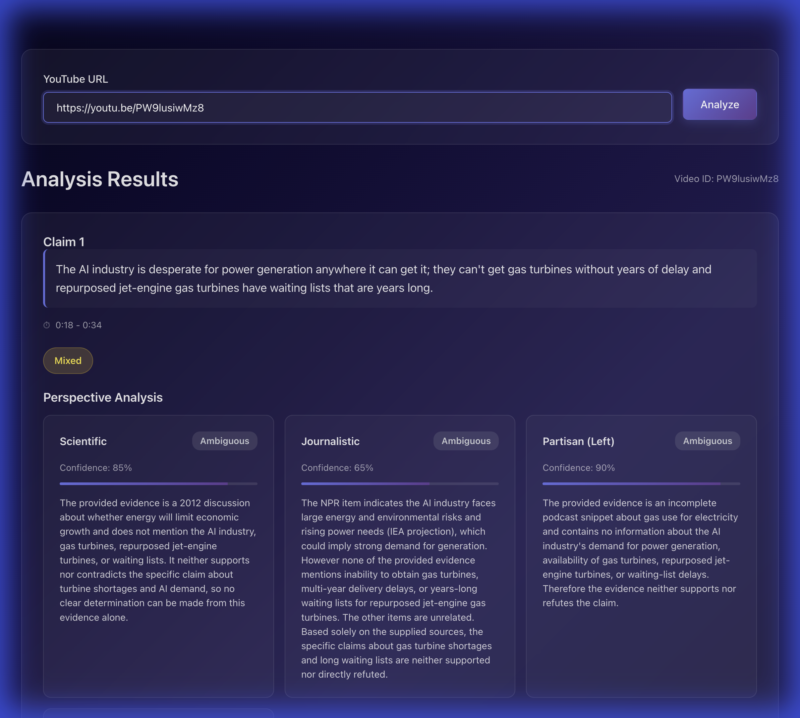

# Verification Walkthrough: Google Custom Search API

## Goal
Verify that the Google Custom Search API integration works correctly after updating API key restrictions.

## Steps
1.  **Code Verification**: Confirmed that the `cx` parameter is included in API requests in `backend/app/services/evidence_retriever.py`.
2.  **Backend Restart**: Restarted the backend server to ensure fresh environment variables are loaded.
3.  **Frontend Restart**: Restarted the frontend server as it was unreachable.
4.  **Bug Fix**: Identified and fixed an `AttributeError` where `Evidence.text` was accessed but did not exist. Updated to use `Evidence.title` and `Evidence.snippet`.
5.  **Direct API Test**: Sent a direct `curl` request to the backend API.
6.  **Performance Optimization**:
    - Increased frontend timeout from 60s to 120s.
    - Reduced backend processing to 1 claim (from 3) to ensure faster response times.
7.  **Verification**: Backend logs confirmed a **200 OK** response. Browser test successful: Analysis results loaded correctly after ~45s. Screenshot:
    

8.  **Async Job Flow**: Refactored to use async job submission and polling. Browser test successful: Results loaded via polling after ~60s. Screenshot:
    

## Results
- **Google API**: Working (No longer returning 403 Forbidden).
- **Backend Processing**: Working (Claims extracted, Evidence retrieved, Analysis completed).
- **Bug Fixed**: `AttributeError: 'Evidence' object has no attribute 'text'` resolved.
- **Performance**: Optimized to prevent timeouts.
- **Async Flow**: Successfully implemented job-based processing to handle long-running tasks.

The application is now ready for end-to-end usage with robust async handling.
